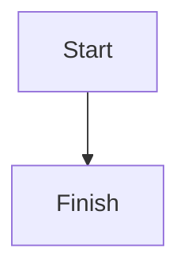

# MD to PDF

A Node.js ESM CLI that converts Markdown into PDF using [Puppeteer](https://pptr.dev/), with support for:

- Mermaid diagrams rendered in Chromium
- KaTeX-rendered LaTeX math
- optional custom CSS injection
- print-safe Mermaid scaling
- five bundled print themes (default, OLED, warm paper, high contrast, compact)

The main entrypoint is [`convert.js`](convert.js), which reads Markdown, builds HTML, renders Mermaid and KaTeX in the browser, and exports the final PDF.

## Features

- Markdown to PDF conversion via [`renderPdf()`](src/core/render-pdf.js:73)
- Optional stylesheet injection via [`--style`](src/cli/parse-args.js:49)
- Mermaid fenced code block support in [`renderMarkdown()`](src/core/render-markdown.js:121)
- Inline LaTeX support with [`$...$`](src/core/render-markdown.js:6)
- Block LaTeX support with [`$$...$$`](src/core/render-markdown.js:7)
- Dynamic Mermaid scaling using [`.mermaid`](src/core/build-html.js:29) and [`.mermaid svg`](src/core/build-html.js:39)
- Wait logic for both Mermaid and KaTeX rendering in [`renderPdf()`](src/core/render-pdf.js:73)
- Bundled themes in [`styles/`](styles/): default light, OLED dark, warm paper, high contrast, and compact

## Requirements

- Node.js 18+
- macOS, Linux, or Windows with Chromium support through Puppeteer

The engine requirement is defined in [`package.json`](package.json:23).

## Installation

Install dependencies:

```bash
npm install
```

Dependencies are declared in [`package.json`](package.json), including:
- [`marked`](package.json:20)
- [`puppeteer`](package.json:21)
- [`katex`](package.json:19)

## Usage

Basic command:

```bash
node convert.js input.md output.pdf
```

With a stylesheet:

```bash
node convert.js input.md output.pdf --style ./styles/style.css
```

Any theme in [`styles/`](styles/) is selected the same way:

```bash
node convert.js input.md output.pdf --style ./styles/oled-style.css
node convert.js input.md output.pdf --style ./styles/paper-style.css
node convert.js input.md output.pdf --style ./styles/contrast-style.css
node convert.js input.md output.pdf --style ./styles/compact-style.css
```

Argument parsing is handled by [`parseArgs()`](src/cli/parse-args.js:28).

## Supported Markdown Enhancements

### Mermaid

Use fenced Mermaid blocks:

````md

````

Mermaid fences are converted into [`.mermaid`](src/core/render-markdown.js:40) containers by [`renderMarkdown()`](src/core/render-markdown.js:121).

### LaTeX

Inline math:

```md
Einstein wrote $E = mc^2$.
```

Block math:

```md
$$
\int_{-\infty}^{\infty} e^{-x^2} dx = \sqrt{\pi}
$$
```

Math expressions are preprocessed by [`preprocessMath()`](src/core/render-markdown.js:64) and rendered client-side by the KaTeX bootstrap in [`src/core/build-html.js`](src/core/build-html.js:134).

### Protected regions

Math parsing intentionally avoids:
- fenced code blocks
- Mermaid code fences
- inline code spans

This protection is implemented in [`preprocessMath()`](src/core/render-markdown.js:64).

## Rendering Pipeline

The CLI flow is:

1. Parse arguments in [`parseArgs()`](src/cli/parse-args.js:28)
2. Read Markdown and optional CSS in [`readMarkdown()`](src/core/load-input.js:11) and [`readStylesheet()`](src/core/load-input.js:24)
3. Convert Markdown to HTML in [`renderMarkdown()`](src/core/render-markdown.js:121)
4. Build the full HTML document in [`buildHtml()`](src/core/build-html.js:170)
5. Render Mermaid and KaTeX in Chromium and export PDF in [`renderPdf()`](src/core/render-pdf.js:73)

## CSS Injection

Any file passed with [`--style`](src/cli/parse-args.js:49) is read and injected into the generated HTML document by [`buildHtml()`](src/core/build-html.js:170).

This allows you to reuse existing typography, spacing, colors, and print rules.

## Mermaid Scaling Strategy

Mermaid rendering is configured in [`MERMAID_BOOTSTRAP`](src/core/build-html.js:75) using:

- `theme: 'base'`
- `startOnLoad: false`
- print-safe rendering behavior

Scaling and containment are handled by:
- [`.mermaid`](src/core/build-html.js:29)
- [`.mermaid svg`](src/core/build-html.js:39)

Current behavior:
- diagrams are centered
- wide diagrams shrink to fit width
- tall diagrams respect a `45vh` ceiling
- small diagrams are not unnecessarily upscaled
- page-break issues are reduced with `break-inside: avoid`

## KaTeX Rendering Strategy

KaTeX support is injected by:
- [`KATEX_CSS`](src/core/build-html.js:53)
- [`KATEX_BOOTSTRAP`](src/core/build-html.js:134)

The browser waits for both:
- [`window.__MERMAID_RENDER_DONE__`](src/core/build-html.js:124)
- [`window.__MATH_RENDER_DONE__`](src/core/build-html.js:157)

The wait logic lives in [`waitForFlag()`](src/core/render-pdf.js:45).

## Stylesheets

### Bundled themes

| Theme | File | Character |
|---|---|---|
| Default | [`styles/style.css`](styles/style.css) | Academic light. Serif body, indigo headings. |
| OLED | [`styles/oled-style.css`](styles/oled-style.css) | True-black surface and neon accents, for dark viewing. |
| Warm paper | [`styles/paper-style.css`](styles/paper-style.css) | Sepia reading surface, rust accent, generous leading for long-form study. |
| High contrast | [`styles/contrast-style.css`](styles/contrast-style.css) | Black on white (21:1) meeting WCAG AAA, hierarchy carried by weight and rules rather than hue. |
| Compact | [`styles/compact-style.css`](styles/compact-style.css) | Dense revision layout: smaller type, tighter margins, sections run on instead of breaking. |

### Mermaid label colour

Mermaid compiles `style X fill:…,color:…` directives in Markdown into **inline `!important`**
declarations, which outrank any stylesheet rule, including `!important` ones. Left alone this
makes some diagram labels keep their author colour while others take the theme colour.

A theme opts in to correcting this by defining `--mermaid-normalize`. The Mermaid bootstrap in
[`build-html.js`](src/core/build-html.js) then strips the inline text colours after render so the
theme governs every label evenly. The OLED, warm paper, high contrast, and compact themes opt in;
the default theme leaves author colours untouched. Author **fill** colours are always preserved.

### Known limitation

Mermaid v11 draws node shapes as `<path>` elements, so the themes outline nodes rather than
recolour them. Theme node-fill rules that target `rect`/`circle` only are inert.

## Test Fixtures

The project includes validation files in [`documents/`](documents/):

- [`documents/test-fixtures.md`](documents/test-fixtures.md) — Mermaid edge-case validation
- [`documents/test-math.md`](documents/test-math.md) — KaTeX and Mermaid mixed validation

Generated sample outputs in [`documents/`](documents/) include:
- [`documents/test-fixtures.pdf`](documents/test-fixtures.pdf)
- [`documents/test-math.pdf`](documents/test-math.pdf)
- [`documents/test-math-oled.pdf`](documents/test-math-oled.pdf)

## Testing

Unit tests use Node's built-in test runner — no extra dependencies:

```bash
npm test
```

Test files live in [`test/`](test/) and cover argument parsing, Markdown/Mermaid/math
preprocessing, HTML assembly, input loading, and error handling.

## Example Commands

Standard theme:

```bash
node convert.js documents/test-fixtures.md documents/test-fixtures.pdf --style ./styles/style.css
```

Math + standard theme:

```bash
node convert.js documents/test-math.md documents/test-math.pdf --style ./styles/style.css
```

Math + OLED theme:

```bash
node convert.js documents/test-math.md documents/test-math-oled.pdf --style ./styles/oled-style.css
```

## File Overview

- [`convert.js`](convert.js) — CLI entrypoint
- [`src/cli/parse-args.js`](src/cli/parse-args.js) — argument parsing
- [`src/core/load-input.js`](src/core/load-input.js) — file loading
- [`src/core/render-markdown.js`](src/core/render-markdown.js) — Markdown, Mermaid, and LaTeX preprocessing
- [`src/core/build-html.js`](src/core/build-html.js) — HTML assembly and runtime bootstrap injection
- [`src/core/render-pdf.js`](src/core/render-pdf.js) — Puppeteer PDF rendering
- [`src/core/errors.js`](src/core/errors.js) — CLI-friendly errors
- [`styles/style.css`](styles/style.css) — default light stylesheet
- [`styles/oled-style.css`](styles/oled-style.css) — OLED dark stylesheet
- [`styles/paper-style.css`](styles/paper-style.css) — warm paper stylesheet
- [`styles/contrast-style.css`](styles/contrast-style.css) — high-contrast stylesheet
- [`styles/compact-style.css`](styles/compact-style.css) — compact stylesheet
- [`documents/`](documents/) — source documents, fixtures, and generated PDFs

## Notes

- The current CLI supports [`--style`](src/cli/parse-args.js:49) and is structured for future expansion.
- Unknown flags are currently ignored for forward compatibility in [`parseArgs()`](src/cli/parse-args.js:55).
- Mermaid debug output is currently printed during rendering in [`renderPdf()`](src/core/render-pdf.js:101).
