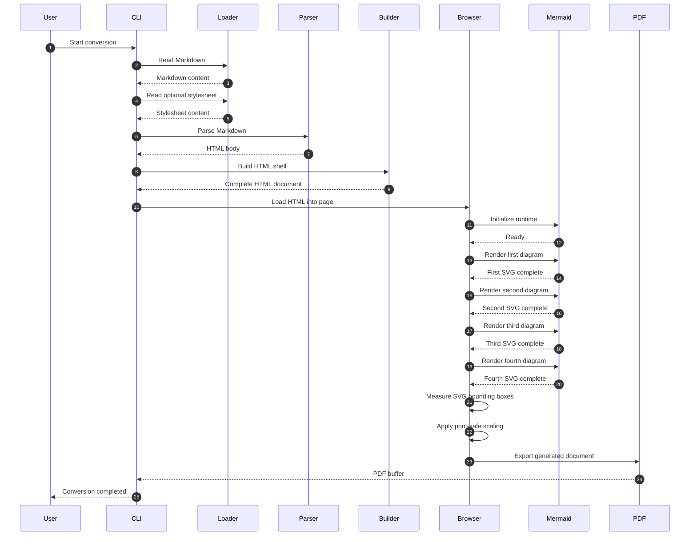
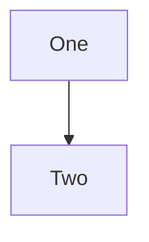
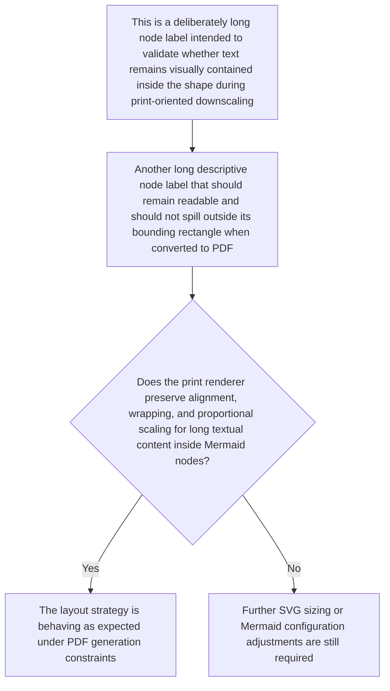
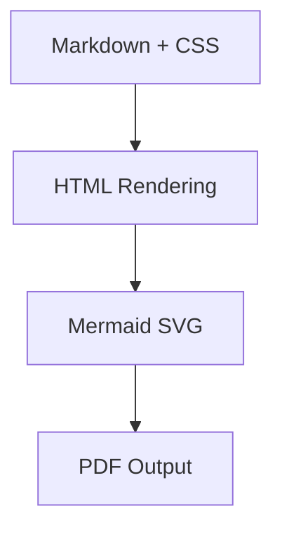

# Mermaid Edge-Case Validation Fixtures

This document exercises print-safe Mermaid scaling behavior across several difficult rendering cases.

## 1. Extremely Wide Flowchart

This chart is intentionally wide to verify horizontal downscaling without destroying legibility or overflowing the content box.

```mermaid
flowchart LR
    A[Start] --> B[Collect Requirements]
    B --> C[Validate Inputs]
    C --> D[Normalize Markdown]
    D --> E[Transform Mermaid Fences]
    E --> F[Inject Custom CSS]
    F --> G[Bootstrap Mermaid Runtime]
    G --> H[Render HTML in Chromium]
    H --> I[Wait for Diagram Completion]
    I --> J[Compute Print Layout]
    J --> K[Scale SVG to Page Constraints]
    K --> L[Export PDF]
    L --> M[Archive Output]
    M --> N[Send Notification]
```

## 2. Very Tall Sequence Diagram

This sequence diagram is intentionally tall and dense to verify the 45vh cap, proportional downscaling, and absence of overlap with surrounding content.

Paragraph after tall diagram: this text should remain clearly below the diagram with no vertical overlap, clipping, or accidental intrusion into the diagram area.

## 3. Small Simple Diagram

This tiny diagram verifies that a small Mermaid block does not get artificially upscaled into an oversized graphic.

## 4. Diagram with Long Node Text

This chart verifies label handling, wrapping, and clipping behavior for long text inside node shapes.

## 5. Mixed Layout Regression Check

Regular content before and after a diagram should remain stable.

### Intro Paragraph

The following chart appears between two ordinary text sections. It should be centered, constrained, and integrated into normal flow without breaking nearby headings or paragraphs.

### Closing Paragraph

If this paragraph appears immediately after the diagram without overlap or clipping, the integration with the print layout flow is behaving correctly.
