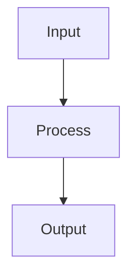

# LaTeX + Mermaid Validation Fixture

This document tests inline math, display math, mixed Mermaid-plus-math content, and edge cases.

## 1. Inline Math

Einstein's famous equation $E = mc^2$ relates energy and mass.

The quadratic formula $x = \frac{-b \pm \sqrt{b^2 - 4ac}}{2a}$ solves $ax^2 + bx + c = 0$.

Inline math inside a paragraph: the value of $\pi$ is approximately $3.14159$, and $e^{i\pi} + 1 = 0$.

## 2. Display Math (Block)

The Gaussian integral:

$$
\int_{-\infty}^{\infty} e^{-x^2} \, dx = \sqrt{\pi}
$$

A matrix representation:

$$
\begin{pmatrix}
a & b \\
c & d
\end{pmatrix}
\begin{pmatrix}
x \\
y
\end{pmatrix}
=
\begin{pmatrix}
e \\
f
\end{pmatrix}
$$

## 3. Mixed Mermaid + Math

A flowchart followed by a display equation.



The processing step above can be expressed as:

$$
f(x) = \frac{1}{\sigma \sqrt{2\pi}} e^{-\frac{1}{2}\left(\frac{x - \mu}{\sigma}\right)^2}
$$

## 4. Math Inside Code (Should NOT Render)

The following code block should show raw LaTeX, not rendered math:

```latex
This is a LaTeX code block:
\int_{-\infty}^{\infty} e^{-x^2} dx = \sqrt{\pi}
```

Inline code: `$E = mc^2$` should appear as raw text.

## 5. Long Equation (Page Break Test)

A long equation to verify overflow handling:

$$
\frac{d}{dx} \left( \int_{a(x)}^{b(x)} f(t) \, dt \right) = f(b(x)) \cdot b'(x) - f(a(x)) \cdot a'(x)
$$

## 6. Mermaid Diagram After Math


## 7. Edge Case: Currency Symbols

The price is $10 for a dozen items, and $3.50 for a single item. These should NOT be treated as math.

Also: $ 5 (space after dollar) should not be math, and 5$ (dollar after number) should not be math.
